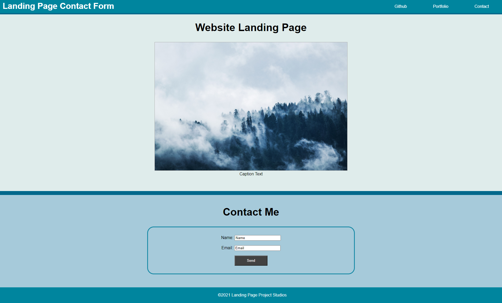

# Unit 01 Mini-Project: Landing Page

## Description

A landing page built using HTML and CSS. It contains a header, footer, an image with a caption and a contact form. 

## Assets

The following image shows the web application's appearance and functionality:

> **Note**: This layout is designed for desktop viewing, so you may notice that some of the elements don't look like the screenshot at a resolution smaller than 768px.

## Link

The link to the deployed application:

Landing Page Contact Form: https://trushilbudhia.github.io/Landing-Page-with-Contact-Form/
